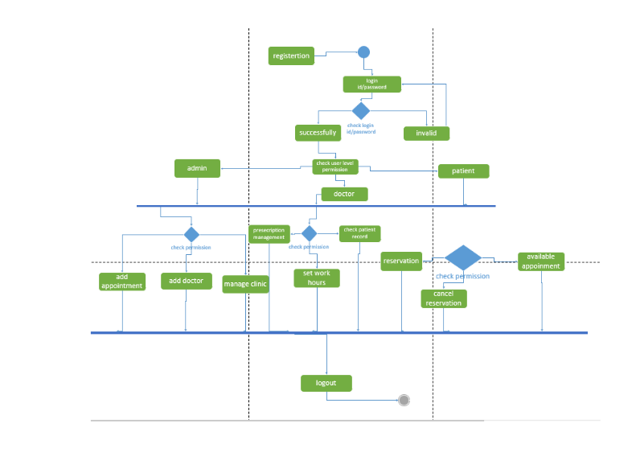

## Activity Diagram in Clinic Management System (CMS)

An Activity Diagram in a Clinic Management System (CMS) illustrates the workflow or series of activities involved in specific processes or tasks within the system. It visually represents the sequence of actions performed by different actors or system components to achieve a particular goal or use case.

### Components:

1. **Actions/Nodes:** Represent specific tasks or actions within the CMS, such as 'Register Patient', 'Schedule Appointment', 'Manage Patient Records', etc.
  
2. **Transitions/Edges:** Arrows indicating the flow or sequence of actions from one task to another.
  
3. **Decision Points:** Points where the flow of activities diverges based on certain conditions, often depicted with diamonds.
  
4. **Initial/Final Nodes:** Represent the start and end points of the activity flow.

### Purpose:

Activity diagrams provide a visual representation of the steps involved in performing a particular process or workflow within the CMS. For instance:
  
- **Patient Registration Process:** Illustrates the sequence of steps involved when a patient registers within the system.
  
- **Appointment Scheduling Workflow:** Demonstrates the sequence of actions from scheduling an appointment to confirmation.
  
- **Managing Patient Records:** Represents the flow of tasks involved in updating or maintaining patient health records.

### Benefits:

- **Clarity:** Offers a clear and concise visual representation of the sequence of actions or steps involved in a process.
  
- **Process Optimization:** Helps in identifying bottlenecks or redundant steps in workflows, facilitating process improvements.
  
- **Communication:** Serves as a communication tool among stakeholders to understand system workflows and functionalities effectively.

