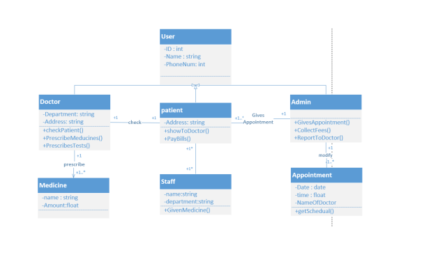

## Class Diagram in Clinic Management System (CMS)

A Class Diagram in a Clinic Management System (CMS) illustrates the structure of the system by depicting the classes, their attributes, methods, and relationships between various entities or classes within the system.

### Components:

1. **Classes:** Represented as boxes, each depicting a particular entity or object within the CMS. For example, classes like 'Patient', 'Doctor', 'Appointment', 'Invoice', etc.

2. **Attributes:** Properties or characteristics of each class, shown within the classes. For instance, 'Patient' class might have attributes like 'patientID', 'name', 'dob', etc.

3. **Methods:** Actions or functionalities that the classes can perform, displayed within or below the classes. For instance, 'Doctor' class might have methods like 'prescribeMedication()', 'updateMedicalRecord()', etc.

4. **Relationships:** Associations or connections between classes, depicted as lines connecting the classes. Relationships can be 'Association', 'Aggregation', 'Composition', 'Inheritance', etc.

### Purpose:

Class diagrams provide a static view of the CMS structure, showing the entities, attributes, and relationships between various classes. For instance:

- **Patient-Doctor Relationship:** Illustrates the association between the 'Patient' and 'Doctor' classes, showcasing how patients are related to their respective doctors.

- **Appointment-Invoice Association:** Depicts the association between 'Appointment' and 'Invoice' classes, indicating how invoices are related to scheduled appointments.

### Benefits:

- **Structural Representation:** Offers a visual representation of the structure and relationships between different entities or classes within the CMS.

- **Design Understanding:** Helps in understanding the entities, their attributes, and how they relate to each other within the system.

- **System Development:** Acts as a blueprint for system developers to understand and implement the functionalities and relationships between classes effectively.

